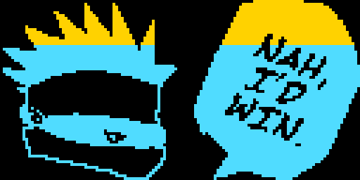
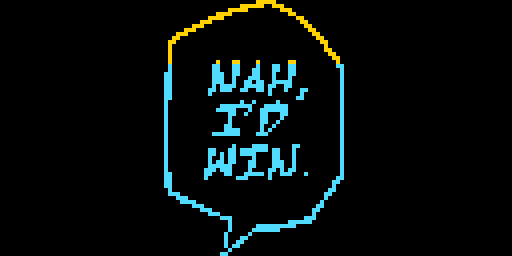
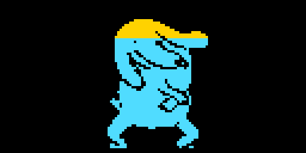
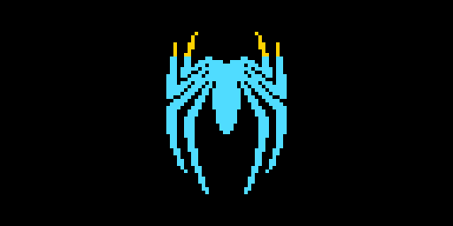
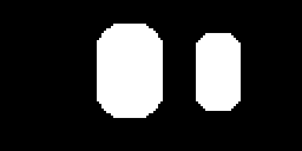

<div align="center">


# OLED Animations

**Animations for 128 by 64 OLED screens. Preview in the browser, download one file, upload a sketch to your ESP32.**

[](https://react.dev)
[](https://vite.dev)
[](https://www.arduino.cc)

</div>

---

## The animations

| | Name | What it does | Comes with |
| :---: | --- | --- | --- |
|  | **Nah, I'd Win 2** | The blindfolded head and the speech bubble with a sliding shine. Two layouts, Line or Fill. | Page, set up guide, ESP32 sketch |
|  | **Nah, I'd Win** | The speech bubble with a sliding shine. Tall or wide, Line or Fill. | Page, set up guide, ESP32 sketch |
|  | **The Boogley** | A dancing character traced from a video, 151 frames at 10 a second. Four styles, any speed. | Page, set up guide, ESP32 sketch with all the frames inside |
|  | **Spidey Transitions** | Three spider emblems traced into 1 bit pixels. Turn them, spin them, or run the glitch show. | Page, set up guide, ESP32 sketch with your settings filled in, and a [make your own](public/animations/spidey-transitions/make-your-own.md) guide with a starter sketch |
|  | **Eye Lab** | A pair of pill shaped eyes that look around, blink and change emotion. | Page |

Every animation is **one HTML file**. It runs in your browser on a simulated 0.96 inch OLED at the board's own frame rate, so what you see is what the glass will show. Download it, keep it, open it offline.

---

## Run the site

```bash
npm install
npm run dev
```

Open http://localhost:5173

`npm run build` makes a `dist/` folder for any static host.

---

## How it is put together

```
animationsbykhizar/
├─ index.html                 the shell Vite fills
├─ src/
│  ├─ animations.js           THE LIST. One entry per animation.
│  ├─ pages/
│  │  ├─ Home.jsx             cards, newest first
│  │  ├─ AnimationPage.jsx    live preview, downloads, Copy HTML, guide
│  │  ├─ MakeYourOwn.jsx      the make your own guide, with the starter sketch
│  │  └─ NotFound.jsx
│  ├─ components/
│  │  ├─ Layout.jsx           top bar, White / Black switch, footer
│  │  └─ AnimationCard.jsx
│  └─ styles.css              all styling, in numbered sections
└─ public/animations/<slug>/
   ├─ index.html              the animation, complete and stand alone (also the download)
   ├─ thumb.png               picture for the card, 2:1
   ├─ guide.md                optional: how to put it on a board
   └─ *.ino                   optional: the Arduino sketch
```

The site shows each animation in a frame opened with `?embed=1`, so the file hides its own header, follows the site's White / Black choice, and reports its height. The same file is what visitors download, so the preview and the download never drift apart.

---

## Add an animation

1. Make a folder `public/animations/my-animation/`.
2. Put the animation in it as `index.html` and add a `thumb.png` (a picture of the screen, 2:1).
3. Add `guide.md` and any sketch files if you have them.
4. Add an entry to `src/animations.js`:

```js
{
  slug: "my-animation",
  title: "My Animation",
  blurb: "One or two sentences for the card.",
  added: "2026-10-03",
  tags: ["bounce", "ESP32 sketch"],
  screen: "128 x 64 OLED, I2C, 0.96 inch",
  files: [{ label: "Download the page", file: "index.html", note: "One HTML file." }],
  guides: [{ title: "How to put it on your board", file: "guide.md" }],
}
```

Save. The card appears at the top of the home page.

---

## The backend

Counts, hearts and payments come from a separate project, `oled-backend` (Vercel functions with Supabase and Paddle). This site only needs its address:

| Setting | Where | Value |
| --- | --- | --- |
| `VITE_API_URL` | Vercel > this site > Environment Variables | The backend's address, for example `https://your-backend.vercel.app` |

It is an address, not a secret. No key ever goes in this site. Without it the site still works: counts are hidden and hearts are kept in the visitor's browser only.

The site publishes its list of animations at `/catalog.json` (written from `src/animations.js` at build time). The backend reads that to know which animations exist.

---

## Free and paid

The home page has two tabs. Every animation is **Free** unless its entry says `tier: "paid"`. A paid entry shows its price on the card and gets a page with what the buyer receives and one Buy button. With `paddlePriceId` set, the button opens Paddle's checkout and the buyer gets their downloads on the `/thanks` page, which keeps working so they never pay twice. Two more public settings switch the checkout on: `VITE_PADDLE_CLIENT_TOKEN` and `VITE_PADDLE_ENV`.

The paid files themselves must not be in this repo's `public/` folder: anything there can be downloaded by anyone. Upload them to the private Supabase bucket `paid-animations`, in a folder named after the slug. The backend hands out download links only after payment. The fields are described at the top of `src/animations.js`.

---

## Small print pages

Support, Refunds, Terms, Privacy and Licence are markdown files in `public/legal/`. Edit the words there; `{{email}}` is replaced with the address in `src/site.js`. Paddle asks for Terms, Privacy and Refund pages before it approves a site for live payments.

---

## Put one on your board

Each animation page has the steps, and Spidey Transitions ships a full guide: parts, wiring, Arduino IDE set up, the BOOT button trick, and what to do when the screen stays dark. Short version:

```
OLED GND  ->  ESP32 GND
OLED VCC  ->  ESP32 3V3
OLED SCL  ->  GPIO 26
OLED SDA  ->  GPIO 25
```

Press **Copy the complete sketch with my settings** on the animation, paste into an empty Arduino sketch, upload.
